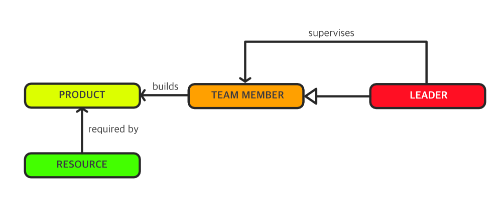
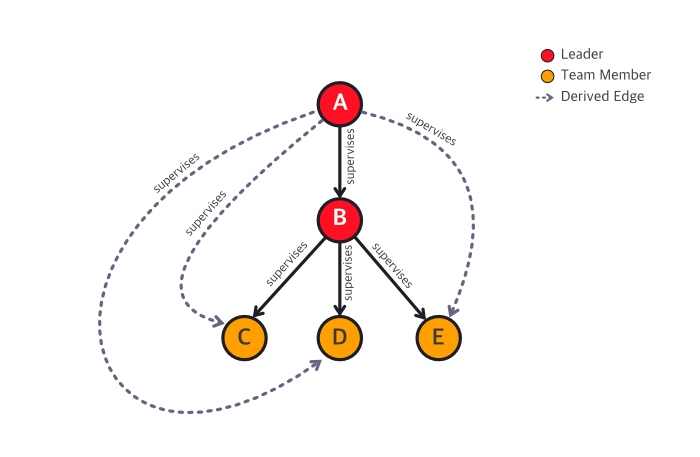
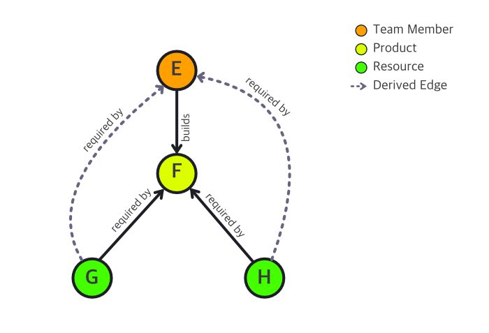
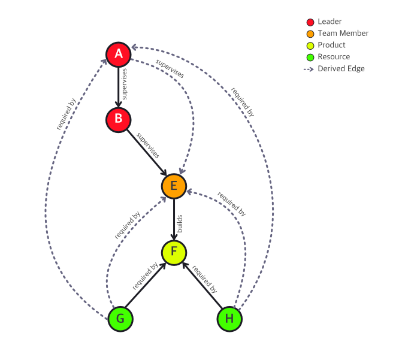

# AMAQL Query Language

AMAQL is a custom pattern matching language, designed to be easy to use and an advanced tool for pattern analysis.

## Getting Started 

The basic constructor of AMAQL is the following Edge Pattern:

> ?[NODE_ELEMENT] [RELATIONSHIP] [NODE_ELEMENT]

Every AMAQL query starts with a question mark, followed by the pattern that must be matched. In the example above, it is presented the most basic pattern, consisting of a "left node", an edge and a "right node".

Of course, you can combine many edge patterns to define a single complex pattern, as defined below:

> ?[NODE_ELEMENT] [RELATIONSHIP] [NODE_ELEMENT] ( [RELATIONSHIP] [NODE_ELEMENT] )*

Also, you might want to perform a simple model query to retrieve all nodes with a certain name or type. For this purpose, you can also make AMAQL queries giving only one node, with (or not) a label or type.

> ?('LABEL':TYPE)

> :bulb: For the sake of simplicity and consistency, the examples presented in this documentation will reference to the following metamodel.

A basic pair of examples are presented below. The first illustrates how to get all nodes with a given name. The second shows how to get all nodes of a specific type:

`?('Slack')`

`?(Resource)`

The philosophy of an AMAQL query is the "analysis by example", i.e., AMAQL expects from the user a pattern example to match through the model. For example, if you want to discover which Team Member builds a specific
Product then you might use the following construction:

`?('product_name':Product)<-[builds]-(TeamMember)`

The result of this query is a list of "Products" and "TeamMembers" that match the described pattern.

The power of AMAQL lies in its ability to query by inference. AMAQL assumes that the input graph contains derived edges resulting from applying the derivation process based on specified derivation rules. Take the following scenario as an example:

In this case, it is natural to infer that if A supervises B, then, by transitivity, A also supervises C, D and E. Of course, derivation rules vary according to your business domain.

For the example above, you could want to query who A supervises.

`?('A':Leader)=[supervises]=>(TeamMember)`

This query uses the **Path Relationship** constructor, represented by `=[...]=>`. The use of this constructor will match any relationship, derived or not, that meets the pattern. In contrast, the use of a **Bound Relationship**, represented by `-[...]->`, will only match non-derived edges.

The following sections detail the primary constructors of AMAQL.

## 1. Nodes

There are four types of nodes, which are described in the sequel.

### 1.1. Described Node

Nodes that contain identifier information about the node. An AMAQL query, in general, only has one Described Node. This type of node can be used when you want to analyze a specific element.

The syntax is presented below:

`([SEARCH_TEXT]:[DOMAIN_TYPE])`

Example:

`?('Jake':Leader)`

### 1.2. Typed Node

A Typed Node describes which nodes you want to return as a result of the query evaluation. Defines a generic node, with the description of its type.

The syntax is presented below:

> ?([DOMAIN_TYPE])

Example:

`?(Resource)`

### 1.3. Group Node

Describes a generic node that captures all nodes of all types. This node is presented in the query result.

The syntax is presented below:

`?(*)`

### 1.4. Non-Described Node

Describes a generic node that doesn't have to be returned to the query result.

The syntax is presented below:

`?()`

### 1.5. Identified Node

Describes a node with a search term attached to it and without type assignment.

The syntax is presented below:

`?('john')`

## 2. Relationships

Another important concept of AMAQL is the Relationship constructor. A Relationship allows the user to specify a link between two nodes to describe a pattern. We can classify a relationship from two perspectives: the indication of a type and the number of hoops (graph edges) between the linked nodes. Over the first perspective (indication of a type), we have two kinds of relationships:

- Short Relationship
- Described Relationship

On the other hand (number of hoops between the linked nodes), we have another two kinds useful for defining navigation semantics:

- Bound Relationship
- Path Relationship

> Note: Relationships cannot be bidirectional.

In the sequel, we will discuss the many kinds of relationships.

### 2.1. Bound Relationship

Stands for an actual link between two nodes, without intermediary nodes between them. The number of hoops considered in this kind of relationship is 1. A Bound relationship is represented by `-[...]->`.

### 2.2. Path Relationship

This type of relationship describes a path between two nodes, including possible intermediary nodes between them and is represented by `=[...]=>`. When you use a Path Relationship, you are trying to match patterns with derived edges. 

A derived edge represents an equivalent edge for the chain of relationships between the source and target nodes. The nature of what can and cannot be derived is defined by the derivation rules applied to your business domain.

In the business context presented in the example below there is a derivation rule that states:

> If a Team Member builds a Product and a Resource is required by this Product, then there is a derived edge "required by" between the Resource and the Team Member.

In this case, you can query for all Resources required by the Team Member E.

`?('E':TeamMember)<=[requiredBy]=(Resource)`

The result of this query is:

| Team Member | Resource |
|-------------|----------|
| E           | G        |
| E           | H        |

### 2.3. Short Relationship

This kind of relationship doesn't have a type associated. It's the simplest way to define a link between two nodes. Its syntax resembles an arrow, and its semantics indicate that any relationship (of any type) between the two nodes will be matched. Short relationships are not allowed for Path Relationships.

Bonded Short Relationships:

`-> | <-`

### 2.4. Described Relationship

This kind of relationship has a type associated. For example, for Path Relationships, a relationship type description is required.

In the case of Bonded Relationship, indicate that the relationship between the two nodes must be of the described type.

The syntax of Described Relationships is presented below:

> [SOURCE_DIRECTION] [[RELATIONSHIP_TYPE]] [TARGET_DIRECTION]

Where:

SOURCE_DIRECTION: `<- | - | <= | =`

TARGET_DIRECTION: `-> | - | => | =`

RELATIONSHIP_TYPE: Domain relationship types

Examples:

`?('car':Resource)=[requiredBy]=>(TeamMember)-[builds]->(Product)`

`?('ana':TeamMember)<=[supervises]=(Leader)`

Going even further, you can take as an example the complete picture of derived edges from our business context. In the image below, a complex scenario is presented, including new derived edges, resulting from the following derivation rule:

> If a Leader supervises a Team Member and a Resource is required by this Team Member, then there is a derived edge "required by" between the Resource and the Leader.

Note that the derived edges illustrated below were derived from other derived edges.

From the graph described above, you can query all the Resources required by Leaders.

`?(Leader)<=[requiredBy]=(Resource)`

The result of this query is:

| Leader | Resource |
|--------|----------|
| A      | G        |
| A      | H        |
| B      | G        |
| B      | H        |

Finally, you can mix Path Relationships and Bound Relationships to query complex patterns. In the example above, you can query for all Products and Resources related to Leader A.

`?('A':Leader)=[supervises]=>()-[builds]->(Product)<-[requiredBy]-(Resource)`

The result of this query is:

| Leader | Product | Resource |
|--------|---------|----------|
| A      | F       | G        |
| A      | F       | H        |

> Note: "E" was not returned due to the use of **Non-Described Node**.

## 3. Constraints

The purpose of AMAQL queries is to provide a suitable platform for complex analysis. To achieve this goal, AMAQL has some constraints to guarantee a predictable performance. The following situations are not allowed.

| Constraint                               | Example                        |
|:-----------------------------------------|:-------------------------------|
| Starting a query with Inclusive Node     | `?(*)<=[supervises]=(Leader)`  |
| Starting a query with Non-Described Node | `?()<=[requiredBy]=(Resource)` |
| Query with Solitary Inclusive Node       | `?(*)`                         |
| Query with Solitary Non-Described Node   | `?()`                          |

## 4. AMAQL Execution

You can find a Pattern Analysis Engine that uses AMAQL as a query language [here](https://github.com/Peritoz/pattern-analysis-engine).